# Oma miniprojekti
Palvelinten hallinta -kurssin miniprojekti(Karvinen 2024). Itse projektin toteutusvaiheita voit seurata tekemästäni [GitHub raportista.](https://github.com/NicklasHH/Palvelinten-hallinta/blob/master/h7%20Miniprojeti/h7%20miniprojekti.md)

---

#### Projektin tarkoitus
Tarkoituksena on luoda pilveen master kone, jonka avulla saadaan paikalliselle virtuaalikone minionille ladattua halutut ohjelmistokehityksen tarpeet helposti. Tämän avulla voin helposti luoda jokaiselle kehitysprojektilleni omat virtuaalikoneet samoilla asetuksilla ja ohjelmistoilla.

---

#### Esitiedot ja vaatimukset
Paikalliselle koneelle tulee olla asennettuna virtualbox, Git sekä Vagrant. Lisäksi käytössä on Digital Ocean, jonne rakensin Master koneen. Tämä ohjeistus toimii ainakin seuraavan kokoonpanon kanssa:
- Windows 11 Home
  - Versio: 23H2
- Nvidia rtx 2060 näytönohjain
  - 6 GB muistia
- Intel i7-9750H prosessori
  - 6 ydintä
- 2 x 8GB Ram
- 1000 GB NVMe m.2 SSD
  - Josta vapaana +700Gb
- Viimeisimmät päivitykset ja ajurit asennettuna 10.5.2024

---

#### Master koneen ohjeet
Osiossa on tehty käyttäjätunnus nimeltä master, vaihda siihen haluamasi käyttäjätunnus. Lisäksi komentoesimerkkien IP-osoite tulee vaihtaa käytössäsi olevaan IP-osoitteeseen.

1. Luo virtuaalikone, itse käytin seuraavia parametrejä Digital Oceanissa
    >Sijainti: Amsterdam  
    OS: Debian 12 x64  
    Droplet type: Basic  
    Ram: 2GB  
    CPU: 1  
    Tallennustila: 50GB  
    Tiedostonsiirtomäärä: 2TB  
    Paikallisen koneen SSH avain oli jo tallennettu Digital Oceaniin, joten lisäsin myös sen kohdalla rastin ruutuun  
    *Ota talteen tietokoneen ip-osoite*  
2. Avaa paikallisen koneen terminaali ja yhdistä virtuaalikoneelle IP-osoitteen avulla komennolla `ssh root@ip-osoite` (esim `ssh root@178.62.241.242`)
3. Tee uusi käyttäjä pilvikoneelle komennolla `sudo adduser masteri` ja anna sille **vahva** salasana, lisää haluamasi tiedot ja kun osio on ohi, lisää sudo oikeudet komennolla `sudo adduser masteri sudo`
4. Avaa vielä Digital Oceanin kautta terminaali tehdylle käyttäjälle ja mene polkuun `/home/masteri/.ssh` jossa komennolla `nano authorized_keys` voit editoida tiedostoa. Lisää tähän tiedostoon paikallisen koneen julkinen SSH avain. Testaa tämän jälkeen SSH yhteys paikallisen koneen terminaalista komennolla `ssh masteri@178.62.241.242`
5. Lukitaan ROOT komennoin `sudo usermod --lock root` ja `sudoedit /etc/ssh/sshd_config` kohdassa P*ermitRootLogin:* **no**. Voit testata lopputulosta komennolla `ssh root@178.62.241.242` jonka ei pitäisi enää toimia.
6. Asennuksia:  
    >`sudo apt-get update`  
    >`sudo apt install micro`  
    >`echo 'export EDITOR=micro' >> ~/.bashrc`  
    >`sudo apt install curl`  
    >`sudo apt install git`  
     
    Salt masterin asennus  
	  >`sudo curl -fsSL -o /etc/apt/keyrings/salt-archive-keyring-2023.gpg https://repo.saltproject.io/salt/py3/debian/12/amd64/SALT-PROJECT-GPG-PUBKEY-2023.gpg`   
    >`echo "deb [signed-by=/etc/apt/keyrings/salt-archive-keyring-2023.gpg arch=amd64] https://repo.saltproject.io/salt/py3/debian/12/amd64/latest bookworm main" | sudo tee /etc/apt/sources.list.d/salt.list`  
    >`sudo apt-get update`  
    >`sudo apt-get install salt-master`  
    >`sudo systemctl enable salt-master && sudo systemctl start salt-master`  

    testaus komennolla `sudo salt-call --local grains.items`  

7. Kloonaa Githubista salt-tiedosto [linkki](https://github.com/NicklasHH/salt) Menemällä polkuun /srv ja antamalla komento `sudo git clone https://github.com/NicklasHH/salt.git`

---

#### Paikallisen virtuaalikoneen ohjeet
1. Lataa vagrantfile [täältä.](https://github.com/NicklasHH/Palvelinten-hallinta/blob/master/h7%20Miniprojeti/vagrantfile)
2. Klikkaa työpöytää oikealla hiirellä ja paina `avaa päätteessä`  
  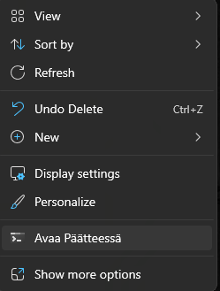
3. Anna komento `Desktop> mkdir testivagrant; cd testivagrant`
4. Työpöydälle tuli kansio `testivagrant`. kopioi sinne ladattu vagrantfile
5. Anna terminaaliin komento `vagrant up` ja odota asennuksen valmistuminen. Tähän menee noin 5 minuuttia. Asennuksen päätyttyä kirjaudu sisään painamalla vagrant ja antamalla salasanan, vakiona `vagrant`  
  
5. Avaa toinen terminaali ja yhdistä Master koneeseen komennolla `ssh masteri@178.62.241.242`
6. Kun Minionin asennus on läpi, hyväksy Masterilla Minionin avain komennolla `sudo salt-key -A` ja kirjoittamalla `Y`  
  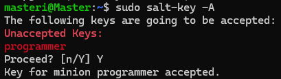
7. Aja tilat Minionille komennolla `sudo salt '*' state.apply programsBionic`. Tämä vie noin neljä minuuttia.  
  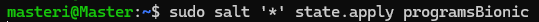  
  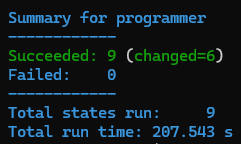
8. Kun tilat on ajettu, on Minion ajokunnossa.  
  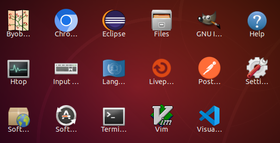
9. Kielen vaihtaminen tapahtuu niin, että painetaan vasemmasta alakulmasta valikko auki, painetaan `Setti...`, 
- Valitaan valikosta `Region & Language` jonka jälkeen painetaan Input Sources osion + näppäintä  
  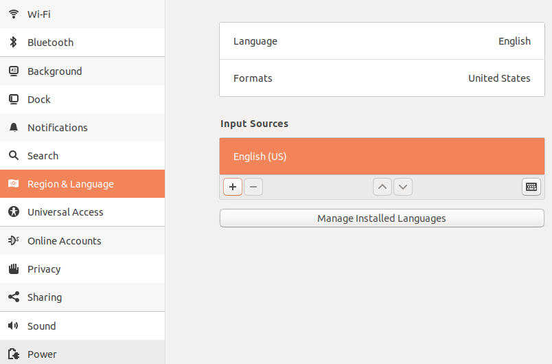
- ja valitaan Finnish  
  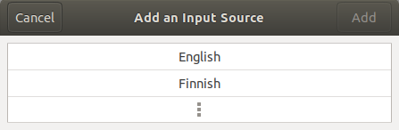
- seuraavassa valikossa Finnish ja lopuksi Vihreää Add painiketta.  
  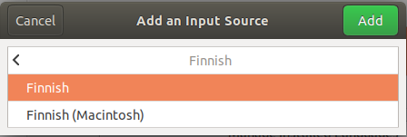
- Tämän jälkeen painetaan Finnish ja nuoli ylöspäin.  
  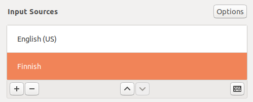
- Viimeisenä painetaan Työpöydän oikealta yläkulmasta `en`  
  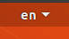
- Vaihdetaan valikosta Finnish  
  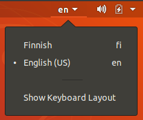
---

#### Huomionarvoiset asiat
Toteutin projektin itselleni, joten tämän toistaminen ei onnistu ilman muokkauksia. Koska käytössä on pilvessä oleva master, ei samat master konfiguraatiot toimi paikalliselle asennukselle. Lisäksi asennettavien ohjelmien kohdalla on eroavaisuuksia käyttöjärjestelmällä. Lopullisessa versiossa käytin Ubuntun Bionic käyttöjärjestelmää paikallisilla virtuaalikoneilla, jolloin jouduin käyttämään useamman ohjelman asennukseen snap paketinhallintaa. Jos haluat tehdä useamman projektin samaan aikaan, kannattaa vagrantfileen vaihtaa programmerin tilalle projektiin hyvin osuva nimi.  

---

#### Käytetty koodi
- [Vagrantfile](vagrantfile)
- [Masterin salt tiedosto](salt)

---

##### Lisenssi kaikelle projektin sisällölle on sama: GNU GPL 3

---

#### Lähteet
Karvinen, T. 2024. Infra as Code - Palvelinten hallinta 2024. Luettavissa: https://terokarvinen.com/2024/configuration-management-2024-spring/. Luettu: 12.5.2024.